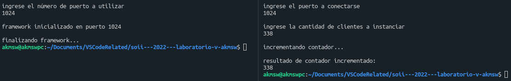

# Embedded systems
## Introduction
El presente es un trabajo práctico de laboratorio cuyo objetivo es el de desarrollar una implementación básica de una *RESTful API* para lograr una visión *end to end* de las mismas sobre un sistema embebido.

## Startup
Para comenzar, se debe clonar el repositorio. Una vez hecho, podemos compilar todo el proyecto aprovechando el archivo makefile, con el comando `make all` o, simplemente `make`. Esto compilará el proyecto con las flags indicadas en la consigna: `-Wall -pedantic -Werror -Wextra -Wconversion -std=gnu11`.\
Como se trabajará con la librería [Ulfius](https://github.com/babelouest/ulfius), se agrega la flag `-lulfius`.

## Development
Como se mencionó en la sección anterior, se hizo uso del framework Ulfius para exponer una REST API.\
Se implementaron los siguientes endpoints:
- `POST: http://localhost:8537/increment`.
- `GET: http://localhost:8537/print`.

El endpoint de solicitudes `POST` se encarga de incrementar un contador interno, y el endpoint de solicitudes `GET` muestra en pantalla el valor del mismo.\
Se utilizó el comando `curl` para modelar los clientes IPv4.

## Ease of use
Se provee un bashscript para levantar el servidor, el cual solicita el número de puerto que se utilizará para escuchar.\
Además, se provee otro bashscript para levantar clientes IPv4 que interactuarán con los endpoints implementados. Este bashscript solicita el puerto a conectarse y la cantidad de clientes a instanciar. Cada cliente ejecutará una solicitud `POST` en background para testear la concurrencia, y cuando todos hayan terminado se ejecutará una solicitud `GET` para mostrar el valor del contador.

## Screenshots

